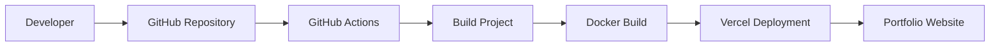

# 🚀 Shubham Dhangar - DevOps Engineer Portfolio


---

# 📌 Project Overview

This repository contains my **personal DevOps & AWS Cloud Engineer Portfolio Website**.

The portfolio showcases:

- 👨‍💻 About Me
- ☁ AWS Cloud Skills
- ⚙ DevOps Skills
- 🚀 Projects
- 📜 Resume Download
- 📞 Contact Information
- 🌐 Responsive Design

The project is containerized using **Docker**, automatically deployed using **GitHub Actions**, and hosted on **Vercel**.

---

# 🌐 Live Website

> [https://YOUR-DOMAIN.vercel.app](https://shubham-dhangar.vercel.app/)

---

# 📸 Portfolio Preview

```
+------------------------------------------------------+
|                    Portfolio Home                    |
|------------------------------------------------------|
|  Profile Image      |   Introduction                 |
|                     |   DevOps Engineer              |
|                     |   AWS Cloud Engineer           |
|------------------------------------------------------|
| Skills | Projects | Resume | Contact | Footer        |
+------------------------------------------------------+
```

---

# 🚀 Technology Stack

| Technology | Purpose |
|------------|----------|
| HTML5 | Web Structure |
| CSS3 | Styling |
| JavaScript | Interactive Features |
| Docker | Containerization |
| Nginx | Web Server |
| GitHub Actions | CI/CD |
| Git | Version Control |
| GitHub | Source Code |
| Vercel | Deployment |

---

# 📂 Project Structure

```
Portfolio/

│
├── .github
│   └── workflows
│       └── deploy.yml
│
├── assets
│   ├── Profile.JPG
│   ├── profile.jpg
│   ├── Resume.pdf
│
├── Dockerfile
├── nginx.conf
├── index.html
├── README.md
│
└── LICENSE (optional)
```

---

# 🏗 High Level Architecture

```text
              Developer

                   │

                   ▼

             Git Push

                   │

                   ▼

            GitHub Repository

                   │

                   ▼

          GitHub Actions (CI)

                   │

       HTML Validation
       Build
       Docker Build

                   │

                   ▼

           Deploy to Vercel

                   │

                   ▼

           Live Portfolio Website
```

---

# ☁ DevOps CI/CD Workflow



---

# 🐳 Docker Architecture

```text

             Docker Build

                  │

                  ▼

        Docker Image Created

                  │

                  ▼

        Nginx Web Server Container

                  │

                  ▼

          Portfolio Website
```

---

# ⚙ GitHub Actions Workflow

```text

Git Push

↓

GitHub Actions Trigger

↓

Checkout Repository

↓

Install Dependencies

↓

Build Website

↓

Deploy to Vercel

↓

Deployment Successful
```

---

# 🚀 Installation

Clone Repository

```bash
git clone https://github.com/S2141/My_Portfolio_Webpage.git
```

Go to project

```bash
cd My_Portfolio_Webpage
```

---

# ▶ Run Locally

Simply open

```
index.html
```

or use VS Code Live Server.

---

# 🐳 Docker

Build Image

```bash
docker build -t portfolio .
```

Run Container

```bash
docker run -d -p 8080:80 portfolio
```

Open

```
http://localhost:8080
```

---

# 🚀 GitHub Actions Deployment

Every push to the **main** branch automatically:

- Checks out code
- Builds the project
- Creates Docker image
- Deploys to Vercel

No manual deployment required.

---

# 📋 Features

✅ Responsive Portfolio

✅ Modern UI

✅ Profile Section

✅ About Me

✅ Skills

✅ Projects

✅ Resume Download

✅ Contact Section

✅ Docker Support

✅ GitHub Actions

✅ Vercel Deployment

---

# 📜 Skills Highlighted

### Cloud

- AWS EC2
- IAM
- S3
- VPC
- Route53
- CloudFront

### DevOps

- Docker
- Kubernetes
- Jenkins
- GitHub Actions
- Terraform
- Ansible

### Monitoring

- Grafana
- Prometheus
- CloudWatch

---

# 📞 Contact

**Shubham Dhangar**

DevOps Engineer

📧 Email

(Add Email)

💼 LinkedIn

(Add LinkedIn URL)

🐙 GitHub

https://github.com/S2141

---

# 📈 Future Enhancements

- Dark Mode
- Blog Section
- Project Dashboard
- Visitor Counter
- Contact Form Backend
- AWS Hosting using EC2
- EKS Deployment
- Terraform Infrastructure
- CloudFront CDN
- SSL Certificate

---

# ⭐ Repository Workflow

```text

Developer

↓

GitHub

↓

GitHub Actions

↓

Docker Build

↓

Vercel

↓

Live Website
```

---

# 📄 License

This project is created for educational and portfolio purposes.

---

# ❤️ Developed By

## Shubham Dhangar

DevOps Engineer | AWS Cloud Engineer

```

### I also recommend adding these diagrams later for an even more professional GitHub repository:
- AWS Architecture Diagram (EC2 → ALB → Route53 → CloudFront)
- Docker Container Architecture
- GitHub Actions CI/CD Pipeline
- Kubernetes (EKS) Deployment Architecture
- Terraform Infrastructure Diagram
- Monitoring Stack (Prometheus → Grafana → CloudWatch)

These will make your repository look like a production-grade DevOps project.
